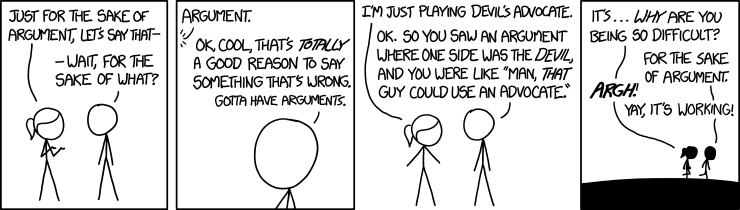
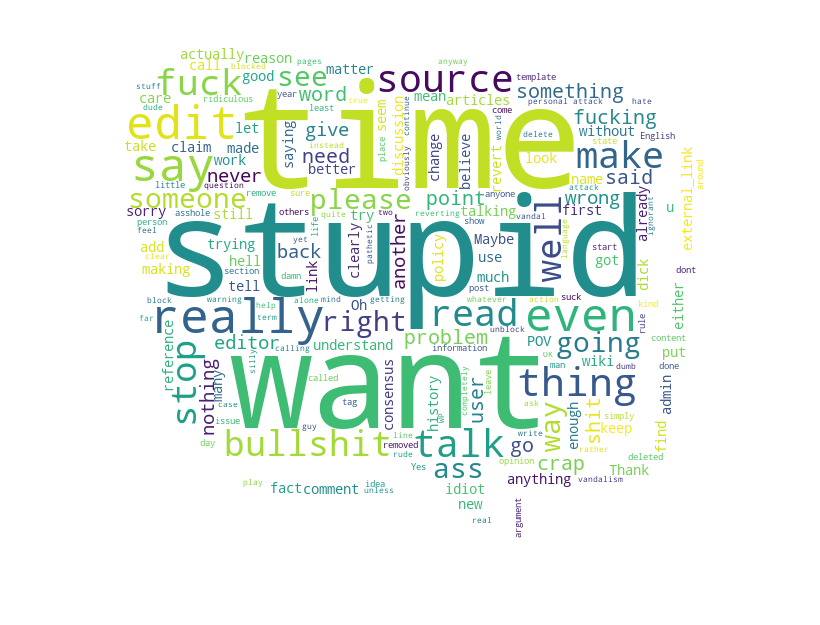
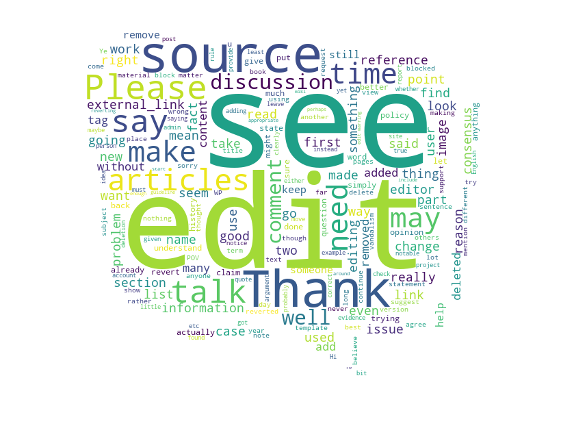

    
     
    
<a href="https://xkcd.com/1432/">Copyright © xkcd</a>

    By swallowing evil words unsaid, no one has ever harmed his stomach. — Winston Churchill

Everyone communicates with other people. Most of the time, the conversations will have happy endings. But sometimes, the conversations maybe go awry. This kind of conversations gone awry are more often on the Internet. Due to the anonymity, online conversations are notorious for simple misunderstandings, personal attacks and antisocial behaviors.

Suppose you are a peace-loving linguist, and what you cannot tolerate are personal attacks, whether it is physical or verbal. One day, you are browsing the Wikipedia, and you find some entries should be modified or corrected. So you make some comments on the Wikipedia talk page. However, some other editors do not agree with your changes, and deny your suggestions. Hence you have a conversation with them:

 

    
     
    
Your conversation with the editors.

 
Wow, this is so implite. This is **personal attack**!! As a linguist, you come up with a brilliant idea: can we detect such kind of unfriendly conversations on the Internet automatically? Further more, is there any linguistic cues that we can use to predict whether the conversation will go awry before it actually happens?

Let's try to utilize a linguistic dataset to analyze this hypothesis. Here we are going to use the **Conversations Gone Awry Dataset**, which is a collection of conversations among Wikipedia editors from Wikipedia talk pages. In the dataset, some of the conversations will derail into personal attacks.

## What Does This Dataset Contain?
Let's have a closer look at this dataset. This dataset contains 2010 **speakers**, 6363 **utterances** and 1168 **conversations**. Among them, 513 speakers said something personal attack, 584 utterances are considered to be personal attack, and half of the conversations (584) contain personal attacks.



- Each **conversation** includes some metadata, and the most important is:
*conversation_has_personal_attack*, which indicates whether any comment in this conversation contains a personal attack according to crowdsourced annotators.
- Each **conversational turn** on the talk page is viewed as an *utterance*. For each utterance, there is also some metadata, and the most important is: *comment_has_personal_attack*, which indicates whether this comment was judged by 3 crowdsourced annotators to contain a personal attack.
- For each **utterance**, there are some attributes:
    + id: index of the utterance
    + speaker: the speaker who author the utterance
    + conversation_id: id of the first utterance in the conversation this utterance belongs to
    + reply_to: index of the utterance to which this utterance replies to (None if the utterance is not a reply)
    + timestamp: time of the utterance
    + text: textual content of the utterance
-  the number of **utterance** distribution per conversation:
To get the information about the distribution of the number of utterances per conversation, we calculate the utterance number for attacked conversation and unattacked conversation and plot the comparison figure. From the figure, we can know that most conversations have 3 to 8 utterances, and the number of gone awry conversations is basically the same as the number of peaceful conversations. Also, the distribution of the attacked conversations and unattacked conversations is almost the same. So our analysis based on this dataset is reliable to explore linguistic harbingers of conversational failure.



## What Did They Say?
So, what exactly did they said on the Wikipedia talk page? Why some utterances are considered to have personal attacks and the others are not. Let's have a look. We divide all the utterances into two groups according to the labels whether or not it contains personal attack. After removing the same stop words, the word clouds for these two groups are shown below.

    
     
    
Wordcloud for utterances with personal attack.

    
     
    
Wordcloud for utterances without personal attack.

Oops! Some words in the wordcloud for the first group seems really rude and toxic. No wonder they are considered to have personal attacks.

## Linguistic Harbingers of Conversational Failure?
We want to study the predictive power of some linguistic cues on conversation failure detection. So, what kind of linguistic cues hidden in the sentences or utterances can be used? Well, we think **sentiment**, **politeness** and **talktiveness** might be able to do that. Intuitively, 

### Sentiment


### Politeness


### Talktiveness


## How Do They Perform?
The intuition is that ontrack conversations will pertain the balance of the above mentioned linguistic cues, while the conversations that will go awry will show some inbalances. Results from the above suggest that linguisitc cues can be subtle signs of the conversation broken in the future.
So, let's verify whether these linguistic cues are useful.

To test whether these linguistic cues have any predictive power and to explore how they interact, we turn to a binary classification setting in which we try to detect whether the conversation will eventually go awry and devolve into a personal attack. We use the same balanced dataset as before, which contains half and half conversations that are ontrack and gone awry.

### Sentiment
Changes in the sentiment expressed in a conversation can reflect the status of the relationship. When we select the sentiment score of each utterance in conversations to predict whether the conversation will go awry, the resulting model achieves a cross-validation accuracy of 53% with 95% bootstrapped confidence.

### Politeness
Linguistic politeness can show consideration for the feelings and desires of one’s interlocutors. To create and uphold interpersonal relationships, the politeness in conversations can be informative. We measure the politeness of each utterance using the Stanford Politeness classifier and use these scores to predict the conversation trends. The resulting model achieves a cross-validation accuracy of 52% with 95% bootstrapped confidence.

### Talktiveness
The amount of communication flowing between the speakers is also relative to the relation among speakers. To quantify the talkativeness, we simply use the number of words sent in each conversation as the feature to predict whether the conversation will go awry.  The resulting model achieves a cross-validation accuracy of 50% with 95% bootstrapped confidence.

### Integrated features
Finally, we integrated all the selected features to test their predictive power. The result of the logistic regression model achieves a cross-validation accuracy of 53% with 95% bootstrapped confidence. This indicates that the classifier is able to exploit subtle linguistic signals that surface in the conversation. 

To sum up, **sentiment**, **politeness** and **talktiveness** features all capture a consistent signal that characterizes people's language when the conversations are about to go awry. 

## Conclusion
