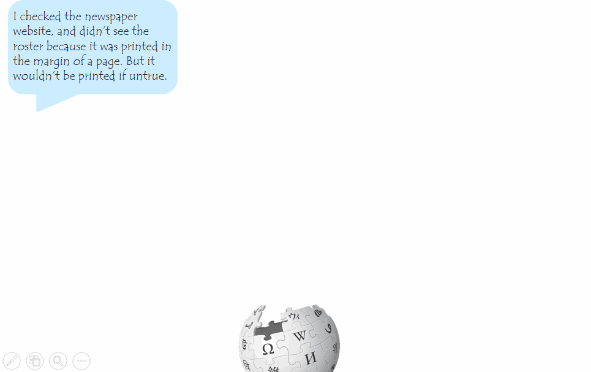

    
     
    
<a href="https://xkcd.com/1432/">Copyright © xkcd</a>

    By swallowing evil words unsaid, no one has ever harmed his stomach. — Winston Churchill

Everyone communicates with other people. Most of the time, the conversations will have happy endings. But sometimes, the conversations maybe go awry. This kind of conversations gone awry are more often on the Internet. Due to the anonymity, online conversations are notorious for simple misunderstandings, personal attacks and antisocial behaviors.

Suppose you are a peace-loving linguist, and what you cannot tolerate are personal attacks, whether it is physical or verbal. One day, you are browsing the Wikipedia, and you find some entries should be modified or corrected. So you make some comments on the Wikipedia talk page. However, some other editors do not agree with your changes, and deny your suggestions. Hence you have a conversation with them:

 

    
     
    
Your conversation with the editors.

 
Wow, this is so implite. This is **personal attack**!! As a linguist, you come up with a brilliant idea: can we detect such kind of unfriendly conversations on the Internet automatically? Further more, is there any linguistic cues that we can use to predict whether the conversation will go awry before it actually happens?

Let's try to utilize a linguistic dataset to analyze this hypothesis. Here we are going to use the **Conversations Gone Awry Dataset**, which is a collection of conversations among Wikipedia editors from Wikipedia talk pages. In the dataset, some of the conversations will derail into personal attacks.

## What Does This Dataset Contain?
Let's have a closer look at this dataset. This dataset contains 2010 **speakers**, 6363 **utterances** and 1168 **conversations**. Among them, 513 speakers said something personal attack, 584 utterances are considered to be personal attack, and half of the conversations (584) contain personal attacks.



More specifically, each **conversation** includes some metadata, and the most important is: *conversation_has_personal_attack*, which indicates whether any comment in this conversation contains a personal attack according to crowdsourced annotators. Each **conversational turn** on the talk page is viewed as an *utterance*. For each utterance, there is also some metadata, and the most important is: *comment_has_personal_attack*, which indicates whether this comment was judged by 3 crowdsourced annotators to contain a personal attack.

To get the information about the distribution of the number of utterances per conversation, we calculate the utterance number for attacked conversations and unattacked conversations and plot the comparison figure. 



From the figure, we can know that most conversations have 3 to 8 utterances, and the number of gone awry conversations is basically the same as the number of peaceful conversations. Also, the distribution of the attacked conversations and unattacked conversations is almost the same. So our analysis based on this dataset is reliable to explore linguistic harbingers of conversational failure.

## What Did They Say?
OK, we know the distribution of the utterances. But what's the content of these utterances? What exactly did they said on the Wikipedia talk page? Why some utterances are considered to have personal attacks and the others are not. Let's have a look. We divide all the utterances into two groups according to the labels whether or not it contains personal attack. After removing the same stop words, the word clouds for these two groups are shown below.

    
     
    
Wordcloud for utterances with personal attack.

    
     
    
Wordcloud for utterances without personal attack.

Oops! Some words in the wordcloud for the first group seems really rude, offensive and toxic. No wonder they are considered to have personal attacks.
Language hurts. Let's "build a machine" to prevent such kind of conversations on the Internet. Instead of identifying antisocial comments after the fact, we aim to detect warning signs indicating that a civil conversation is at risk of derailing into such undesirable behaviors.

## Can We Perceive The Conversation Failure Ahead of Time?
For the sake of argument, there are always conversations meant to fail. You just knew it when something is going wrong. The question is can we automatically detect the cues of online conversation failures ahead of time?
It is revealed in a case study based on the Diplomacy online game (Niculae et al., 2015) that subtle signs of imminent betrayal are encoded in the conversational patterns of the dyad, even if the victim is not aware of the relationship’s fate. Particularly, the online-game case study shows that lasting friendships exhibit a form of balance that manifests itself through language, while sudden changes in the balance of certain conversational attributes — such as positive sentiment, politeness, impend betrayal. We truly want to delve into the juicy real-world dataset, to find out the predictive power of those harbingers of imbalance, to shout out loud: **Ha! I knew it!**

Intuitively, if the linguistic signs are salient, there's no need to predict, the conversation failure is easily noticed. Given this, we would hope for subtle cues. Here we mainly look into **sentiment**, **politeness** and **talkativeness**. 

### Sentiment
In conversations, there are positive sentiment (e.g. “I will still be thrilled if …”), negative sentiment (e.g. “It’s not a great expression …”) or neural sentiment (e.g. flat questions). Changes in sentiment can reflect emotional responses, social affect, as well as the status of the relationship as a whole (Gottman and Levenson, 2000; Wang and Cardie, 2014). We quantify the proportion of exchanged sentences that transmit positive, neutral and negative sentiment using the Stanford Sentiment Analyzer (Socher et al., 2013).



From the figure we find that an imbalance in the amount of positive sentiment expressed by the speakers is a subtle sign that the conversation will end in personal attack. When looking closer at who is the source of the imbalance, we find that it is the "victims" that use significantly less positive sentiment than the "perpetrators", who eventually say something toxic. This is surprising and somewhat counterintuitive.

### Politeness
Differences in levels of politeness can echo betrayals in Diplomacy games (Niculae et al., 2015). Using the Stanford Politeness classifier, we measure the politeness of each utterance. It is unexpected to see that both attackers and victims show very little politeness in the conversations. But it is reasonable since this is online, and basically no one knows you and you know no one. Anonymous sometimes can reveal the true human nature.



We can also see that the both parties involved in an awry conversation show less politeness compared with the participants in an ontrack conversation. Besides, conversations gone awry show a slight imbalance between the level of politeness. Not surprisingly, the attacker who jeopardize the conversation is more impolite, which also reflects that Politeness is not an ideal subtle cues to foretell the track of conversations.

### Talktiveness
Another conversational aspect is the amount of communication flowing between the conversation participants, in each direction. To quantify this, we simply use the number of words in each utterance. It seems that victims send a slightly more words than the attackers in a conversation. While there is a subtle imbalance, it seems not significantly different.



Anyway, these results show that there are indeed some subtle linguistic imbalance signals that are indicative of the future fate of the conversations.

## How Do They Perform?
The intuition is that ontrack conversations will pertain the balance of the above mentioned linguistic cues, while the conversations that will go awry will show some inbalances. Results from the above suggest that linguisitc cues can be subtle signs of the conversation broken in the future.
So, let's verify whether these linguistic cues are useful.

To test whether these linguistic cues have any predictive power and to explore how they interact, we turn to a binary classification setting in which we try to detect whether the conversation will eventually go awry and devolve into a personal attack. We use the same balanced dataset as before, which contains half and half conversations that are ontrack and gone awry.

### Sentiment
Changes in the sentiment expressed in a conversation can reflect the status of the relationship. When we select the sentiment score of each utterance in conversations to predict whether the conversation will go awry, the resulting model achieves a cross-validation accuracy of 53% with 95% bootstrapped confidence.

### Politeness
Linguistic politeness can show consideration for the feelings and desires of one’s interlocutors. To create and uphold interpersonal relationships, the politeness in conversations can be informative. We measure the politeness of each utterance using the Stanford Politeness classifier and use these scores to predict the conversation trends. The resulting model achieves a cross-validation accuracy of 52% with 95% bootstrapped confidence.

### Talktiveness
The amount of communication flowing between the speakers is also relative to the relation among speakers. To quantify the talkativeness, we simply use the number of words sent in each conversation as the feature to predict whether the conversation will go awry.  The resulting model achieves a cross-validation accuracy of 50% with 95% bootstrapped confidence.

### Integrated features
Finally, we integrated all the selected features to test their predictive power. The result of the logistic regression model achieves a cross-validation accuracy of 53% with 95% bootstrapped confidence. This indicates that the classifier is able to exploit subtle linguistic signals that surface in the conversation. 

To sum up, **sentiment**, **politeness** and **talktiveness** features all capture a consistent signal that characterizes people's language when the conversations are about to go awry. 

## Ha! I Knew It!
So far so good. In this datastory, we study how the subtle linguistic imbalance signals relate to future conversational failure. We focus on the particularly perplexing scenario, in which one participant of a civil conversation later attack other people in verbal, and finally leading this conversation go awry. To this end, we extend the proposed computational framework in (Niculae et al., 2015) for analyzing how linguistic cues, like sentiment, politeness, and talktiveness in a conversation are tied to its future trajectory.

Extensive analysis of the linguistic cues show that the subtle imbalance signals of these cues have the predictive power to predict the fate of an initial civil conversation. While the effects we find are subtle, they verify that it is possible to achieve such an objective via linguistic cues. There are also some limitations 

    
     
    
 It's easier to be an asshole to words than to people. <a href="https://xkcd.com/438/">Copyright © xkcd</a>

### References
 1. Vlad Niculae, Srijan Kumar, Jordan Boyd-Graber, and Cristian Danescu-Niculescu-Mizil. 2015. Linguistic harbingers of betrayal: A case study on an online strategy game. In Proceedings of ACL.  
 2. John M. Gottman and Robert W. Levenson. 2000. The
timing of divorce: Predicting when a couple will divorce over a 14-year period. Journal of Marriage and Family, 62(3):737–745.  
 3. Lu Wang and Claire Cardie. 2014. A piece of my mind: A sentiment analysis approach for online dispute detection. In Proceedings of the Association for Computational Linguistics.  
 4. Richard Socher, Alex Perelygin, Jean Y Wu, Jason
Chuang, Christopher D Manning, Andrew Y Ng, and Christopher Potts. 2013. Recursive deep models for semantic compositionality over a sentiment treebank. In Proceedings of Emperical Methods in Natural Language Processing. 
