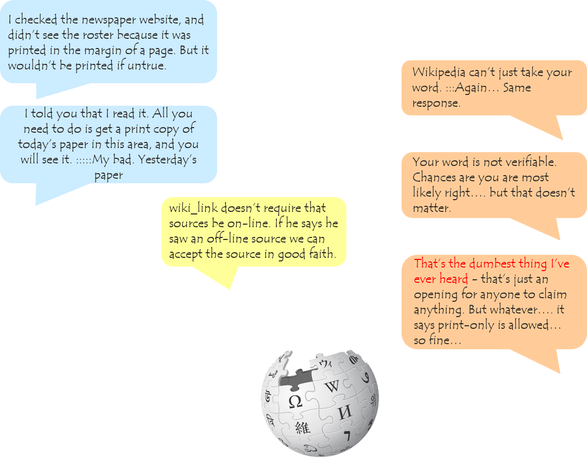

    
     
    
<a href="https://xkcd.com/1432/">Copyright © xkcd</a>

    By swallowing evil words unsaid, no one has ever harmed his stomach. — Winston Churchill

Everyone communicates with other people. Most of the time, the conversations will have happy endings. But sometimes, the conversations maybe go awry. This kind of conversations gone awry are more often on the internet. Due to the anonymity, online conversations are notorious for simple misunderstandings, personal attacks and antisocial behaviors.

Suppose you are a peace-loving linguist, and what you cannot tolerate are personal attacks, whether it is physical or verbal. One day, you are browsing the Wikipedia, and you find some entries should be modified or corrected. So you make some comments on the Wikipedia talk page. However, some other editors do not agree with your changes, and deny your suggestions. Hence you have a conversation with them:

 

    

Wow, this is so implite. This is **personal attack**!! 

## Introduction

Detecting such kind of unfriendly conversations on the internet is quite critical. The question is, is there any linguistic cues that we can use to predict whether the conversation will go awry before it actually happens.

## Dataset and Wikipedia Talk Page Discussions

To do the analysis, we turn to use a dataset of Wikipedia talk page discussion. The dataset contains 

## Linguistic Harbingers of Conversational Failure

### Sentiment

### Politeness

### Talktiveness

## Predictive Power

## Conclusion